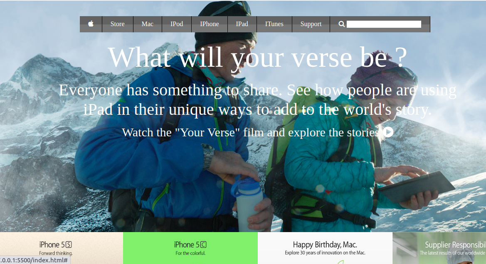

# apple-page-clone
This is a clone of apple page.

## Built With

- html & css,
- Visual Studio Code, Git and Github.

## Live Demo
[Live Demo Link](https://rashidmvk.github.io/)

## Authors

👤 **Author**

- Github: [@rashidmvk](https://github.com/rashidmvk)
- Linkedin: [@rashidmvk](https://www.linkedin.com/in/rashidmvk)
- Twitter: [@rashidnm](https:www.twitter.com/rashidnm)

## 🤝 Contributing

Contributions, issues and feature requests are welcome!

Feel free to check the [issues page](issues/).

## Show your support

Give a ⭐️ if you like this project!

## Acknowledgments

- Hat tip to anyone whose code was used
- Inspiration
- etc

## 📝 License

This project is [MIT](lic.url) licensed.
